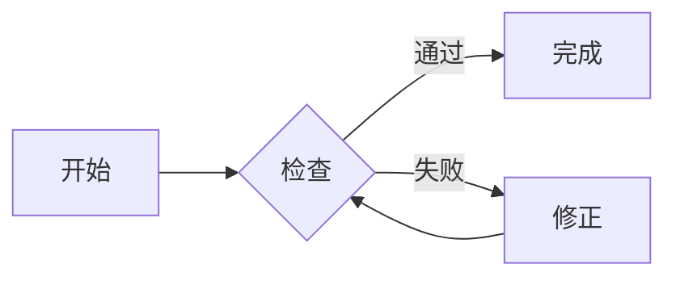
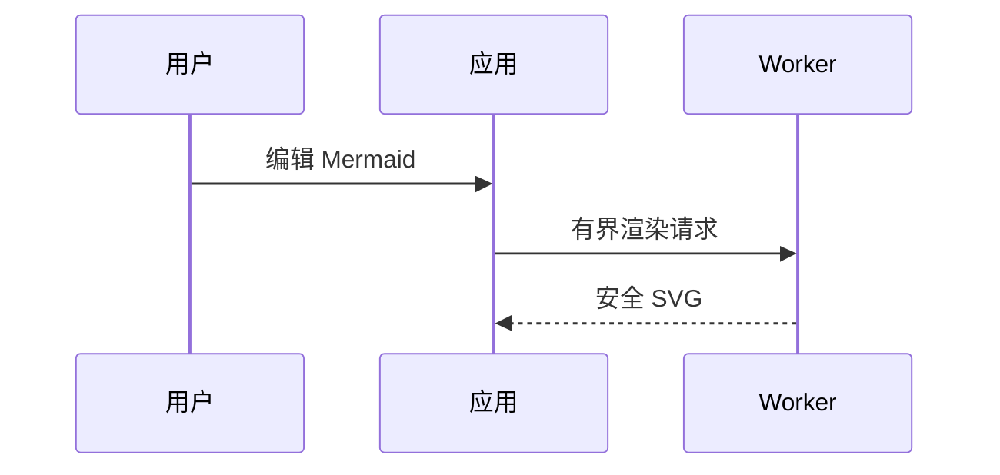

# Mermaid smoke document

This fixture exercises offline native rendering, CJK labels, more than one diagram, and reuse of
the persistent renderer worker.

```mermaid
flowchart LR
    A[开始] --> B{检查}
    B -->|通过| C[完成]
    B -->|失败| D[修正]
    D --> B
```

```mermaid
sequenceDiagram
    participant 用户
    participant 应用
    participant Worker
    用户->>应用: 编辑 Mermaid
    应用->>Worker: 有界渲染请求
    Worker-->>应用: 安全 SVG
```
